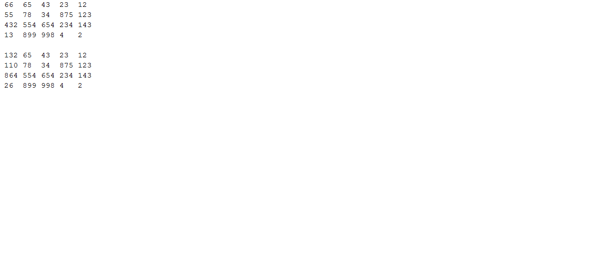

3.1 Имеется двумерный массив 4x5 в виде списка. Сделать консольную программу, которая вводит данные массива с  клавиатуры, осуществляет заданный вариантом алгоритм и выводит полученный список - результат на экран. Если минимальный элемент стоит во втором столбце, то заменить элементы этого столбца нулями.

